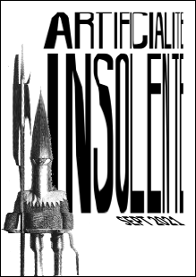
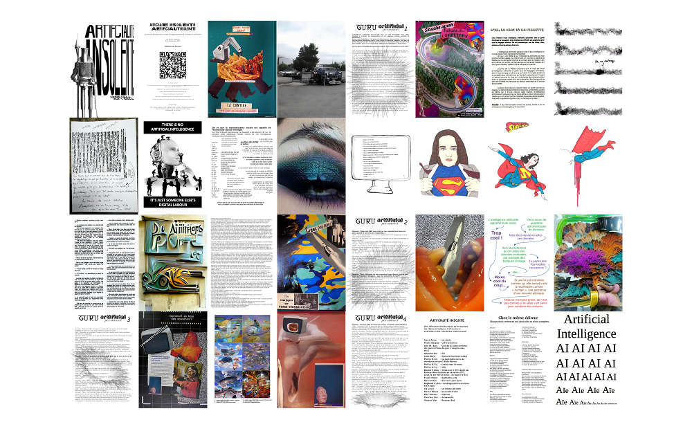

# Zine (A)rtificialité (I)nsolente

Script d'assemblage pour le fanzine de la résidence artificialité insolente
Certaines pages sont créées en piochant des images dans un répertoire, puis elles sont assemblées dans un second temps par un script bash  en utilisant convert (imagemagick) sous forme de pages comprenant 2 images A5 (format A4 paysage)
Ces pages sont ensuite assemblées dans un unique fichier pdf, à imprimer, agrafer et massicoter!

Chaque exemplaire est caractérisé par un timestamp unique AAAA-MM-JJ_HH:MM:SS  
3 fichiers pour chaque exemplaire :  
 * version print : les pages sont assemblées pour l'impression
 * version web : les pages sont dans l'ordre
 * chemin de fer : toutes les pages en miniature

DEMARRER :  
 * dans un terminal : `php ./montage_zine_ai.php --exemplaires=10`

COMMENT IMPRIMER ?  
 * paysage, recto-verso, bord court
 * plier la première page, agrafer l'ensemble en se servant de la marque de pli comme repère
 * massicoter en suivant les traits de coupe

Exemple d'un chemin de fer :

Exemplaire lisible à télécharger : [zine artificialité insolente](http://lesporteslogiques.net/wiki/_media/recherche/residence_artificialite_insolente/zine_artificialite_insolente_web.pdf) (pdf, 10 Mo)
